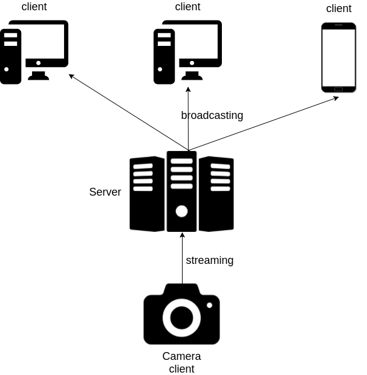
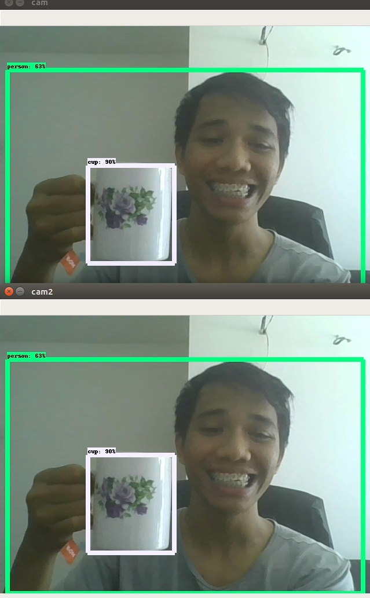

# Tensorflow-Streaming
Broadcast Tensorflow object detection using Socket IO for WebRTC and OpenCV2 / gtk



## Requirements
  * NumPy
  * TensorFlow >= 1.4
  * matplotlib
  * scipy
  * Python 3.X
  * Flask socket-io
  * Flask
  * OpenCV

## How to install packages
```bash
pip3 install numpy tensorflow==1.4 scipy matplotlib flask-socketio socketio_client opencv-contrib-python
```

You also can use Tensorflow-GPU
```bash
pip3 install tensorflow-gpu==1.4
```

You also can use OpenCV build from sources

You also can use Tensorflow build from sources

## Instructions

1. Download any model you preferred for Tensorflow object detection from [here](https://github.com/tensorflow/models/blob/master/research/object_detection/g3doc/detection_model_zoo.md)
2. Untar and put it in any folder module {webrtc, opencv2} you want.
3. Open that folder module, and edit object_detection.py
```python
# replace it with your own folder name
MODEL_NAME = 'ssd_mobilenet'
```
4. Change IP or Port you preferred.

## Example




